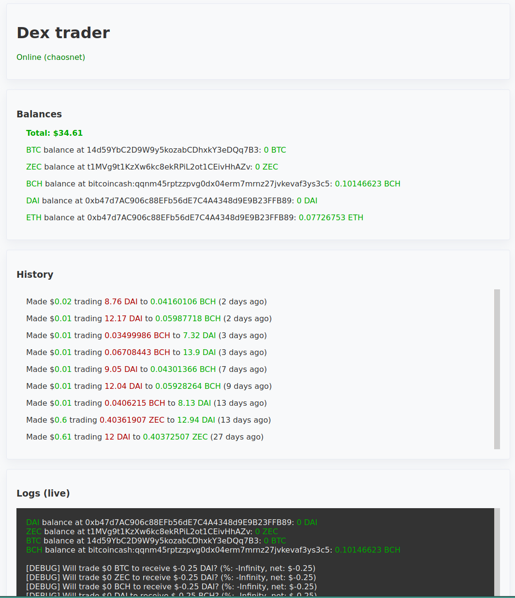

# `📈 chaosdex-trading-bot`

ChaosDEX trading bot built with [RenJS](https://github.com/renproject/ren-js).

## Running locally

Clone the repo, install the dependencies and generate a new private key:

```sh
git clone git@github.com:renproject/chaosdex-trading-bot.git
cd ./chaosdex-trading-bot
npm install
echo 'console.log(`PRIVATE_KEY="${require("send-crypto").newPrivateKey()}"`)' | node >> .env
```

Add to the `.env` file:

```sh
INFURA_KEY="" # Generated at infura.io
NETWORK="chaosnet"
DATABASE_URL="" # OPTIONAL - Postgres database for persistance
```

and then run:

```sh
yarn start
```

## Screenshot



## Development

See [chaosdex/execute.ts](./src/chaosdex/execute.ts) for how `chaosdex-trading-bot` uses RenJS to mint and burn Bitcoin, Bitcoin Cash and Zcash onto Ethereum.

There are two main components, 1) the tactic for deciding on trades and 2) the interface to the trading platform:
1. There's 1 tactic, a simple tactic that performs any trade that is currently profitable.
2. There's 1 interface, which executes trades on [ChaosDEX](https://chaosdex.renproject.io).